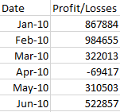
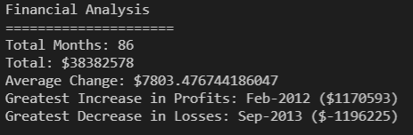

# Python Homework - Py Me Up, Charlie

## Background

In order to help getting used to programming and analyzing data in Python a series of tests were done using something that approximates a real world scenario.  As a result two tests were done in order to better get accustomed to using real-world data.  The two challenges for this will be called PyBank and PyPoll.  PyBank is a series of simulated financial records for a bank and to solve this scenario it needs to be analyzed.  PyPoll is supposed to be an attempt to help a small town to modernize it vote counting process.

## PyBank

* In this test, an Analysis of financial records was to be obtained. The dataset is composed of two columns: `Date` and `Profit/Losses`. (Thankfully, the company has rather lax standards for accounting so the records are simple.)

* A preview of the dataset is seen below.

* The output for the datased is expected to include the following information:

  * The total number of months included in the dataset

  * The net total amount of "Profit/Losses" over the entire period

  * Calculate the changes in "Profit/Losses" over the entire period, then find the average of those changes

  * The greatest increase in profits (date and amount) over the entire period

  * The greatest decrease in losses (date and amount) over the entire period

* As an example, your analysis should look similar to the one below:

* In addition, the final script will print a text file with the results of the terminal.

## PyPoll

* In this test is regarding helping a small, rural town modernize its vote counting process.

* You will be give a set of poll data called [election_data.csv](PyPoll/Resources/election_data.csv). The dataset is composed of three columns: `Voter ID`, `County`, and `Candidate`. A Python script needs to be made that analyzes the votes and calculates each of the following:

  * The total number of votes cast

  * A complete list of candidates who received votes

  * The percentage of votes each candidate won

  * The total number of votes each candidate won

  * The winner of the election based on popular vote.

* The Resulting 

* In addition, the final script will print a text file with the results of the terminal.

